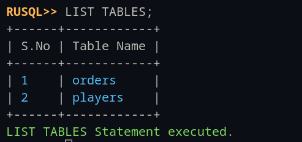

# RUSQL - A SQLite-like Database Engine in Rust

[](https://opensource.org/licenses/MIT)
[](https://www.rust-lang.org/)

RUSQL is a lightweight, educational SQLite-like database engine implemented in Rust. It provides a colorful and interactive REPL interface for executing SQL commands and managing database schemas.

## Project Goals

- **Educational**: Demonstrate database internals and storage engine design
- **Lightweight**: Minimal dependencies, pure Rust implementation
- **Interactive**: Beautiful CLI experience with syntax highlighting
- **Extensible**: Clean architecture for adding new features

## Architecture & Design

### Storage Engine Design

RUSQL implements a **columnar storage model** inspired by modern analytical databases:

```
Table Structure:
┌─────────────────────────────────────┐
│          Table Metadata             │
│  - Name, Schema, Primary Key        │
└─────────────────────────────────────┘
         ↓
┌─────────────────────────────────────┐
│       Column Storage (BTreeMap)      │
│  Column1: {rowid: value, ...}       │
│  Column2: {rowid: value, ...}       │
│  Column3: {rowid: value, ...}       │
└─────────────────────────────────────┘
         ↓
┌─────────────────────────────────────┐
│     Indexes (BTreeMap)              │
│  Index1: {value: rowid, ...}        │
│  Index2: {value: rowid, ...}        │
└─────────────────────────────────────┘
```

**Benefits:**

- Fast column scans for analytical queries
- Efficient memory usage with sparse data
- Natural compression opportunities
- Cache-friendly access patterns

### Implementation Methodology

RUSQL follows established database design patterns:

1. **Parser-Driven Approach**: Uses the battle-tested [sqlparser-rs](https://github.com/sqlparser-rs/sqlparser-rs) library
2. **Columnar Storage**: BTreeMap-based column storage inspired by DuckDB and Apache Arrow
3. **Index Structures**: Separate index storage for fast lookups (B-Tree indexes)
4. **REPL Pattern**: Interactive shell using [rustyline](https://github.com/kkawakam/rustyline)

### Key Algorithms

- **Primary Key Auto-increment**: Monotonic counter-based ID generation
- **Unique Constraint Validation**: Hash-based duplicate detection using BTreeMap indexes
- **Column-oriented Insertion**: Transposed row insertion into column stores

## Getting Started

### Prerequisites

- Rust 1.70 or higher
- Cargo (comes with Rust)

### Installation

```bash
git clone https://github.com/HN026/Rusql.git
cd Rusql
cargo build --release
cargo run
```

### Quick Start

```sql
-- Create a table
CREATE TABLE users (
    id INTEGER PRIMARY KEY,
    email TEXT UNIQUE NOT NULL,
    name TEXT,
    age INTEGER
);

-- Insert data
INSERT INTO users (email, name, age) VALUES ('alice@example.com', 'Alice', 30);
INSERT INTO users (email, name, age) VALUES ('bob@example.com', 'Bob', 25);

-- View table data
-- (Automatically displayed after INSERT)

-- List all tables
LIST TABLES;

-- Drop a table
DROP TABLE users;
```

## Features

### Current Features

- `CREATE TABLE`: Create tables with various data types and constraints
- `DROP TABLE`: Delete tables from the database
- `INSERT INTO`: Add new rows to tables
- `LIST TABLES`: Display all tables in the database
- **Data Types**: INTEGER, TEXT, REAL, BOOLEAN
- **Constraints**: PRIMARY KEY, UNIQUE, NOT NULL
- **Auto-increment Primary Keys**: Automatic ID generation
- **Command History**: Persistent command history with suggestions
- **Syntax Highlighting**: Colorful output and error messages
- **Schema Visualization**: Pretty-printed table schemas

### Future Improvements

- `SELECT`: Query data with WHERE clauses, JOINs, and aggregations
- `UPDATE`: Modify existing rows
- `DELETE`: Remove rows from tables
- **Persistence**: Disk-based storage with write-ahead logging (WAL)
- **Transactions**: ACID-compliant transaction support
- **Query Optimization**: Cost-based query optimizer
- **Foreign Keys**: Referential integrity constraints
- **Views**: Virtual tables from queries
- **Full-text Search**: Text search capabilities

## Resources & Theory

### Database Internals

Understanding RUSQL's design requires knowledge of fundamental database concepts:

#### 1. Storage Models

- **Row-Oriented Storage (NSM - N-ary Storage Model)**
  - Traditional RDBMS approach (MySQL, PostgreSQL)
  - Stores entire rows together
  - Good for OLTP (transactional workloads)
- **Column-Oriented Storage (DSM - Decomposition Storage Model)** ⭐ _Used in RUSQL_
  - Stores columns separately
  - Excellent for OLAP (analytical workloads)
  - Better compression ratios

**Further Reading:**

- [Column-Oriented Database Systems](https://www.vldb.org/pvldb/vol5/p1790_andrewlamb_vldb2012.pdf)
- [The Design and Implementation of Modern Column-Oriented Database Systems](https://stratos.seas.harvard.edu/files/stratos/files/columnstoresfntdbs.pdf)

#### 2. Index Structures

RUSQL uses **B-Tree indexes** for fast key lookups:

```
BTreeMap<Value, RowID>
  - Self-balancing tree structure
  - O(log n) search, insert, delete
  - Ordered iteration
```

**Further Reading:**

- [The Ubiquitous B-Tree](https://dl.acm.org/doi/10.1145/356770.356776) - ACM Computing Surveys
- [Modern B-Tree Techniques](https://w6113.github.io/files/papers/btreesurvey-graefe.pdf)

#### 3. SQL Parsing

Uses **recursive descent parsing** via sqlparser-rs:

```
SQL Text → Lexical Analysis → Tokens → Syntax Analysis → AST
```

**Further Reading:**

- [sqlparser-rs Documentation](https://docs.rs/sqlparser/latest/sqlparser/)
- [Building a SQL Parser](https://blog.logrocket.com/building-rust-parser/)

#### 4. REPL Design

Interactive shell pattern:

```
Read → Parse → Execute → Print → Loop
```

**Further Reading:**

- [Read-Eval-Print Loop (REPL) Pattern](https://en.wikipedia.org/wiki/Read%E2%80%93eval%E2%80%93print_loop)

### Recommended Books

1. **Database Internals** by Alex Petrov
   - Comprehensive guide to storage engines
   - Covers B-Trees, LSM trees, and more

2. **Database Design and Implementation** by Edward Sciore
   - Excellent for understanding database architecture

3. **The Rust Programming Language** by Steve Klabnik and Carol Nichols
   - Essential for understanding Rust-specific implementations

### Academic Papers

- [Architecture of a Database System (2007)](https://dsf.berkeley.edu/papers/fntdb07-architecture.pdf)
- [What Goes Around Comes Around (2005)](https://people.cs.umass.edu/~yanlei/courses/CS691LL-f06/papers/SH05.pdf) - History of data models

### Online Resources

- [CMU Database Systems Course](https://15445.courses.cs.cmu.edu/) - Excellent lectures and assignments
- [SQLite Documentation](https://www.sqlite.org/arch.html) - Architecture inspiration
- [Let's Build a Simple Database](https://cstack.github.io/db_tutorial/) - Tutorial in C

## Development

### Running Tests

```bash
# Run all tests
cargo test

# Run tests with output
cargo test -- --nocapture

# Run specific test file
cargo test --test integration_tests

# Run with coverage
cargo tarpaulin --out Html
```

### Code Quality

```bash
# Format code
cargo fmt

# Run linter
cargo clippy -- -D warnings

# Check for security issues
cargo audit
```

### Benchmarking

```bash
# Run benchmarks
cargo bench

# Profile performance
cargo build --release
perf record ./target/release/rusql
```

## Usage Examples

### Meta Commands

RUSQL supports special meta-commands for REPL control:

```bash
.help    # Display help message
.exit    # Exit the REPL
.cls     # Clear the screen
```

See [Meta Commands Documentation](./util/metacommands.md) for details.

### SQL Examples

#### Creating Tables

```sql
-- Simple table
CREATE TABLE users (id INTEGER PRIMARY KEY, name TEXT);

-- Table with constraints
CREATE TABLE employees (
    id INTEGER PRIMARY KEY,
    email TEXT UNIQUE NOT NULL,
    department TEXT,
    salary REAL,
    is_active BOOLEAN
);
```

#### Inserting Data

```sql
-- Insert with specific columns
INSERT INTO users (name) VALUES ('Alice');

-- Insert with all columns
INSERT INTO employees (email, department, salary, is_active)
VALUES ('alice@corp.com', 'Engineering', 95000.0, true);

-- Auto-increment primary key
INSERT INTO users (name) VALUES ('Bob');  -- Gets id=2 automatically
```

#### Managing Tables

```sql
-- List all tables
LIST TABLES;

-- Drop a table
DROP TABLE users;
```

## Project Structure

```
Rusql/
├── src/
│   ├── main.rs              # Binary entry point
│   ├── lib.rs               # Library entry point
│   ├── error.rs             # Error types and handling
│   ├── repl/                # REPL implementation
│   │   └── mod.rs          # Line editor, highlighter, validators
│   ├── replloop.rs          # Main REPL loop
│   ├── meta_command/        # Meta-command handling
│   │   └── mod.rs
│   ├── sql/                 # SQL processing
│   │   ├── mod.rs           # Query processor
│   │   ├── db/              # Database core
│   │   │   ├── database.rs  # Database container
│   │   │   └── table.rs     # Table and column storage
│   │   └── parser/          # SQL parsers
│   │       ├── create.rs    # CREATE TABLE parser
│   │       ├── insert.rs    # INSERT parser
│   │       ├── drop.rs      # DROP TABLE parser
│   │       └── list_tables.rs
│   └── util/                # Utilities
│       ├── intro.rs         # Welcome banner
│       └── mod.rs
├── tests/                   # Integration tests
│   ├── database_tests.rs
│   ├── table_tests.rs
│   ├── parser_tests.rs
│   ├── error_tests.rs
│   └── integration_tests.rs
├── util/                    # Documentation and schemas
│   ├── metacommands.md
│   ├── Images/
│   └── Schemas/
├── Cargo.toml
├── README.md
└── LICENSE
```

## Contributing

Contributions are welcome! Here's how to get started:

### Fork & Create a Branch

```bash
git checkout -b feature/your-feature-name
```

### Make Your Changes

1. Write clean, idiomatic Rust code
2. Add tests for new functionality
3. Update documentation as needed
4. Ensure all tests pass: `cargo test`
5. Format your code: `cargo fmt`
6. Run clippy: `cargo clippy`

### Submit a Pull Request

- Provide a clear description of changes
- Reference any related issues
- Ensure CI passes

### Code Style Guidelines

- Follow Rust naming conventions
- Comment complex algorithms
- Write descriptive commit messages
- Keep functions focused and small
- Prefer immutability when possible

## Screenshots

#### CREATE TABLE


#### INSERT INTO TABLE


#### DROP TABLE


#### LIST TABLES



## License

This project is licensed under the MIT License - see the [LICENSE](LICENSE) file for details.

## Links

- **GitHub**: [HN026/Rusql](https://github.com/HN026/Rusql)
- **Author**: [Huzaifa Naseer](https://github.com/HN026)
- **LinkedIn**: [Huzaifa Naseer](https://www.linkedin.com/in/huzaifanaseer/)

## Acknowledgments

- [sqlparser-rs](https://github.com/sqlparser-rs/sqlparser-rs) - SQL parsing
- [rustyline](https://github.com/kkawakam/rustyline) - REPL functionality
- [prettytable-rs](https://github.com/phsym/prettytable-rs) - Table formatting
- SQLite - Design inspiration
- CMU 15-445 Database Systems course - Educational foundation

## Roadmap

### Version 0.2.0 (Planned)

- [ ] SELECT statement support
- [ ] WHERE clause filtering
- [ ] Basic aggregations (COUNT, SUM, AVG)

### Version 0.3.0 (Planned)

- [ ] UPDATE and DELETE statements
- [ ] Multi-table JOINs
- [ ] Subqueries

### Version 0.4.0 (Planned)

- [ ] Disk persistence
- [ ] Write-Ahead Logging (WAL)
- [ ] Transaction support

---

**Built with Rust**
