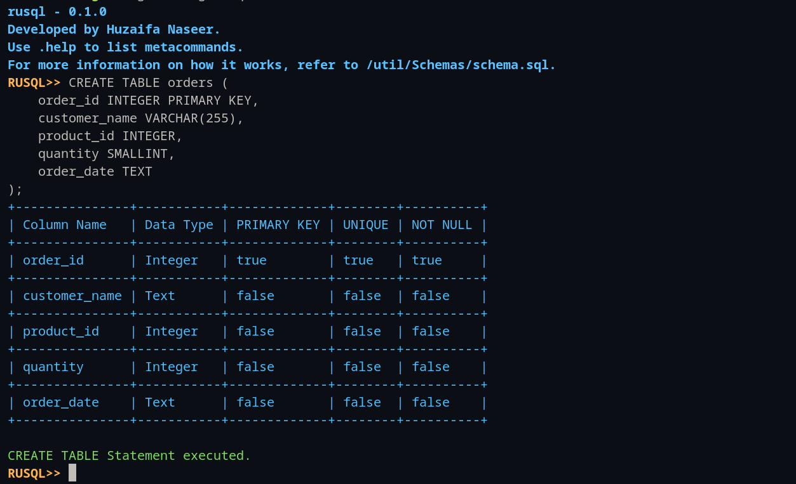
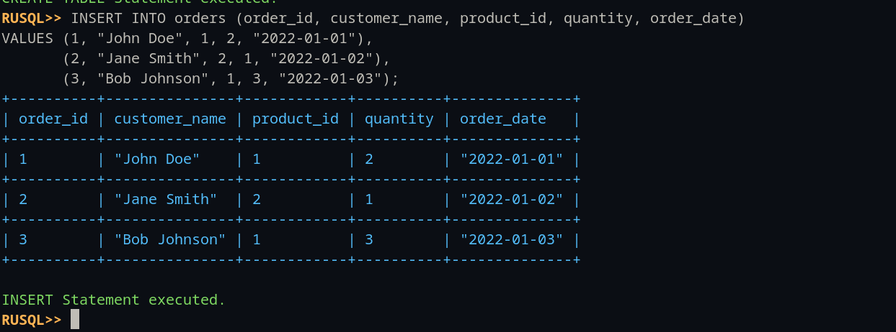

# RUSQL

RUSQL is a SQLite-like database implemented in the Rust programming language.

## Overview

RUSQL is a SQLite-like database implemented in the Rust programming language. It provides a colorful and interactive interface for viewing and printing database schemas, making it easy to visualize the structure of your data. RUSQL aims to provide a lightweight, efficient, and easy-to-use database solution for Rust applications. It supports a subset of SQL syntax and provides basic database functionalities such as creating tables, inserting data, and querying data.

## Getting Started

To get started with RUSQL, follow these steps:

```bash
git clone https://github.com/HN026/Rusql.git
cd Rusql
cargo build
cargo run
```

## Features

- Lightweight and efficient
- Supports a subset of SQL syntax
- Basic CRUD operations
- Implemented in Rust

## Current Features

- `CREATE TABLE`: Create a new table with specified columns and data types.
- `DROP TABLE`: Delete an existing table.
- `INSERT`: Insert new data into a table.
- Command History: View the history of commands, with suggestions and persistent saving across sessions.

## Future Improvements

- `SELECT`: Retrieve data from a table.
- `UPDATE`: Update existing data in a table.
- `DELETE`: Delete data from a table.
- Data persistence: Save data to disk and load it back into the database across sessions.
- Improved error handling: Provide more detailed error messages and handle more edge cases.
- Support for more SQL syntax: Add support for more complex SQL queries and statements.
- Testing: Implement unit tests and integration tests to ensure the reliability and correctness of the database.

# Contributing to RUSQL

First off, thank you for considering contributing to RUSQL. It's people like you that make RUSQL such a great tool.

## Where do I go from here?

If you've noticed a bug or have a feature request, make sure to check our [Issues](https://github.com/HN026/Rusql/issues) to see if someone else in the community has already created a ticket. If not, go ahead and make one!

## Fork & create a branch

If this is something you think you can fix, then fork RUSQL and create a branch with a descriptive name.

A good branch name would be (where issue #123 is the ticket you're working on):

```bash
git checkout -b feature/123-AddNewFeature
```

## Usage

For usage examples, please refer to the following screenshots:

#### CREATE TABLE

#### INSERT INTO TABLE

#### DELETE TABLE


You can also find SQL schema examples in the [Schemas](/util/Schemas/schema.sql) file.

## License

This project is licensed under the [MIT License](LICENSE.md).

## Contact

Feel free to connect with me on [LinkedIn](https://www.linkedin.com/in/huzaifanaseer/) and [GitHub](https://github.com/HN026).